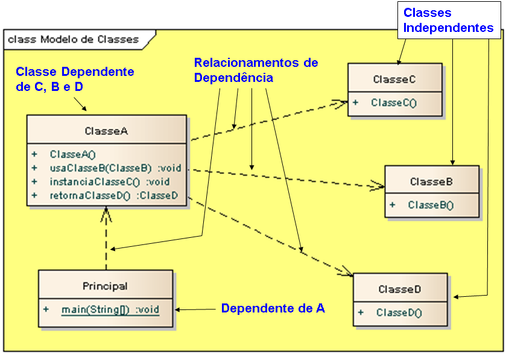

# Exemplo de implementação de relacionamento dependência em Java.

## Contextualização

- Programa em Java que demostra a implementação do relacionamento dependência. 
- Dois elementos de modelo: um dependente e um independente. 
- Uma modificação no elemento independente poderá afetar o elemento dependente. 
- O relacionamento pode acontecer entre diversos tipos de elementos de modelo. 
- Não há associação explícita entre os elementos. 
- O projeto foi desenvolvido no NetBeans deve ser chamado relacionamento_uml_dependencia_java. 
- Utiliza o Apache Maven para a automatização da construção. 

## Diagrama de classes

## Arquivo do projeto

O arquivo Modelo.EAP é o projeto do sistema utilizando ferramanta CASE Enterprise Arquitect.

## Outros arquivos

- pom.xml - Arquivo de configuração da ferramenta de automação Maven.
- *.bat - Arquivos de lote(Batch) de console para tarefas compilar, executar, documentar, empacotar e limpar o projeto.